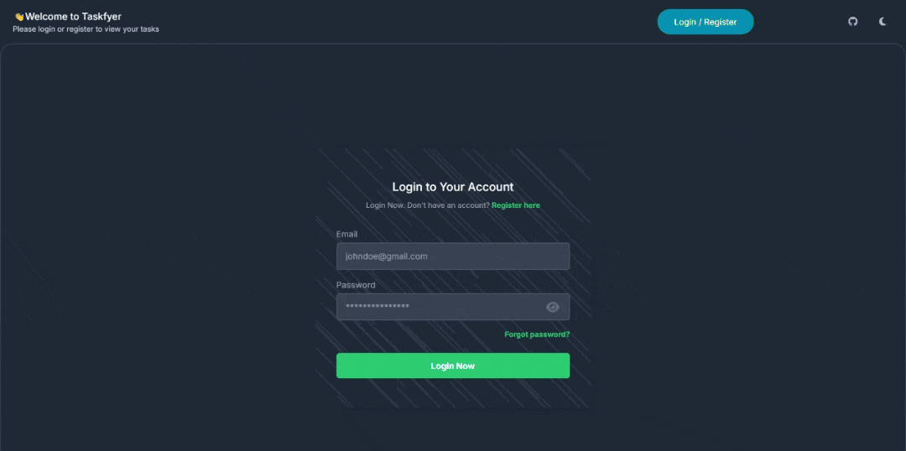

<p align="center">
  
</p>


<h1 align="center">Taskfyer Documentation</h1>

---

<table align="center" style="width:100%; border-collapse:collapse;">
  <tr>
    <th align="left">Section</th>
    <th align="left">Description</th>
  </tr>
  <tr>
    <td><a href="#introduction">Introduction</a></td>
    <td>Overview of Taskfyer and its purpose</td>
  </tr>
  <tr>
    <td><a href="#motivation">Motivation</a></td>
    <td>Why Taskfyer was created</td>
  </tr>
  <tr>
    <td><a href="#features">Features</a></td>
    <td>Key functionalities of the app</td>
  </tr>
  <tr>
    <td><a href="#architecture-overview">Architecture Overview</a></td>
    <td>High-level system design</td>
  </tr>
  <tr>
    <td><a href="#tech-stack">Tech Stack</a></td>
    <td>Technologies used</td>
  </tr>
  <tr>
    <td><a href="#user-roles--permissions">User Roles & Permissions</a></td>
    <td>Access levels for users and admins</td>
  </tr>
  <tr>
    <td><a href="#security-considerations">Security Considerations</a></td>
    <td>Security features and best practices</td>
  </tr>
  <tr>
    <td><a href="#api-overview">API Overview</a></td>
    <td>RESTful endpoints and usage</td>
  </tr>
  <tr>
    <td><a href="#getting-started">Getting Started</a></td>
    <td>Setup instructions and prerequisites</td>
  </tr>
  <tr>
    <td><a href="#usage-guide">Usage Guide</a></td>
    <td>How to use the main features</td>
  </tr>
  <tr>
    <td><a href="#folder-structure">Folder Structure</a></td>
    <td>Project directory layout</td>
  </tr>
  <tr>
    <td><a href="#deployment">Deployment</a></td>
    <td>How to deploy Taskfyer</td>
  </tr>
  <tr>
    <td><a href="#troubleshooting">Troubleshooting</a></td>
    <td>Common issues and solutions</td>
  </tr>
  <tr>
    <td><a href="#faq">FAQ</a></td>
    <td>Frequently asked questions</td>
  </tr>
  <tr>
    <td><a href="#contributing">Contributing</a></td>
    <td>How to contribute to the project</td>
  </tr>
  <tr>
    <td><a href="#presentation">Presentation</a></td>
    <td>Links to presentation and documentation</td>
  </tr>
  <tr>
    <td><a href="#author">Author</a></td>
    <td>Project creator information</td>
  </tr>
</table>

---

## Introduction

**Taskfyer** is a modern, full-stack task management application built with the MERN stack (MongoDB, Express.js, React, Node.js). It enables users to efficiently manage their tasks with features like priorities, due dates, completion tracking, and admin user management. The app is designed for responsiveness and supports both light and dark modes.

---

## Motivation

Task management is essential for productivity, both for individuals and teams. Taskfyer was created to provide a simple yet powerful tool for organizing daily work, tracking progress, and collaborating securely. The project also serves as a learning resource for developers interested in building scalable MERN stack applications.

---

## Features

- **User Authentication:** Register, login, and logout securely.
- **Task CRUD:** Add, edit, delete, and view tasks.
- **Task Priorities & Due Dates:** Assign priorities and deadlines to tasks.
- **Completion Tracking:** Mark tasks as completed or pending.
- **Bulk Actions:** Delete all tasks at once.
- **Responsive Design:** Optimized for mobile and desktop.
- **Dark Mode:** Switch between light and dark themes.
- **Admin Panel:** Manage users and their tasks.
- **Notifications:** Real-time feedback using toast notifications.
- **Filtering & Sorting:** Filter tasks by status and sort by due date or priority.

---

## Architecture Overview

Taskfyer follows a classic MERN stack architecture:

- **Frontend:** Next.js (React) for UI, Tailwind CSS for styling, Context API for state management, and react-hot-toast for notifications.
- **Backend:** Node.js with Express.js for RESTful APIs.
- **Database:** MongoDB for persistent storage.
- **Authentication:** JWT-based authentication for secure user sessions.

**Data Flow:**
1. User interacts with the React frontend.
2. Frontend communicates with backend APIs via HTTP.
3. Backend processes requests, interacts with MongoDB, and returns responses.
4. State is managed on the client using React Context.

---

## Tech Stack

- **Frontend:** Next.js, React, Tailwind CSS, react-hot-toast
- **Backend:** Node.js, Express.js, MongoDB, JWT
- **State Management:** React Context API
- **Testing:** (Add your testing framework here if any)
- **Deployment:** (Vercel, Heroku, or your preferred platform)

---

## User Roles & Permissions

- **Regular User:** Can manage their own tasks (CRUD), view their profile, and use all task features.
- **Admin User:** Has all regular user permissions plus the ability to view, edit, or delete any user's tasks and manage user accounts.

---

## Security Considerations

- **Password Hashing:** User passwords are hashed before storage.
- **JWT Authentication:** Secure tokens for session management.
- **Input Validation:** All API endpoints validate input to prevent injection attacks.
- **CORS:** Configured to allow only trusted origins.
- **Rate Limiting:** (Optional, recommended for production)

---

## API Overview

The backend exposes RESTful endpoints for authentication, user management, and task operations.

### Authentication

- `POST /api/auth/register` - Register a new user
- `POST /api/auth/login` - Login and receive JWT
- `POST /api/auth/logout` - Logout user

### Tasks

- `GET /api/tasks` - Get all tasks for the user
- `POST /api/tasks` - Create a new task
- `PUT /api/tasks/:id` - Update a task
- `DELETE /api/tasks/:id` - Delete a task
- `DELETE /api/tasks` - Delete all tasks

### Admin

- `GET /api/admin/users` - List all users
- `DELETE /api/admin/users/:id` - Delete a user

> **Note:** All endpoints require authentication except registration and login.

---

## Getting Started

### Prerequisites

- Node.js (v16+ recommended)
- npm or yarn
- MongoDB instance (local or cloud)

### Setup

1. **Clone the repository:**
   ```bash
   git clone https://github.com/ahmednasser111/task-management-system.git
   cd task-management-system
   ```

2. **Install dependencies:**
   ```bash
   npm install
   # or
   yarn install
   ```

3. **Configure environment variables:**

   Create a `.env` file in the `client` directory:

   ```
   NEXT_PUBLIC_SERVER_URL=http://localhost:8000
   ```

   Adjust the URL if your backend runs elsewhere.

4. **Start the development server:**
   ```bash
   npm run dev
   # or
   yarn dev
   ```

   The app will be available at [http://localhost:3000](http://localhost:3000).

### Backend Setup

1. Navigate to the `/server` repo.
2. Follow the instructions in `/server/README.md` to configure environment variables and start the backend server.
3. Ensure MongoDB is running and accessible.

---

## Usage Guide

### Task Management

- **Add Task:** Click "Add Task", fill in the details, and submit.
- **Edit Task:** Click the edit icon next to a task, update fields, and save.
- **Delete Task:** Click the delete icon to remove a task.
- **Bulk Delete:** Use the "Delete All" button to remove all tasks.

### Filtering & Sorting

- Use the sidebar to filter tasks by status: All, Completed, Pending, Overdue.
- Sort tasks by due date or priority using the sort options.

### Dark Mode

- Toggle the theme switch in the header or sidebar to switch between light and dark modes. The preference is saved locally.

### Admin Panel

- Admin users can access the admin panel from the sidebar.
- View all users, delete users, and manage any user's tasks.

---

## Folder Structure

- `/app` - Next.js app directory (pages, components)
    - `/app/components` - Reusable UI components
    - `/app/pages` - Application pages and routes
- `/context` - React Context providers for user and tasks
- `/public` - Static assets (icons, images)
- `/providers` - Layout and theme providers
- `/utils` - Utility functions and helpers
- `/hooks` - Custom React hooks

---

## Deployment

1. **Frontend:** Deploy the `client` directory to Vercel, Netlify, or your preferred platform.
2. **Backend:** Deploy the `server` repo to Heroku, Render, or any Node.js hosting provider.
3. **Environment Variables:** Set production environment variables on your deployment platform.
4. **Domain & SSL:** (Optional) Configure a custom domain and SSL certificate.

---

## Troubleshooting

- **App won't start:** Ensure Node.js and MongoDB are installed and running.
- **Cannot connect to backend:** Check `NEXT_PUBLIC_SERVER_URL` and backend server status.
- **Database errors:** Verify MongoDB URI and credentials.
- **Authentication issues:** Ensure JWT secret is set and tokens are valid.
- **Styling issues:** Confirm Tailwind CSS is properly configured.

---

## FAQ

**Q: Can I use a cloud MongoDB instance?**  
A: Yes, update your backend `.env` with the cloud MongoDB URI.

**Q: How do I add more user roles?**  
A: Extend the user schema and update role checks in the backend.

**Q: Is there a mobile app?**  
A: No, but the web app is fully responsive.

---

## Contributing

Pull requests are welcome! For major changes, please open an issue first to discuss what you would like to change.

**How to contribute:**
1. Fork the repository.
2. Create a new branch for your feature or bugfix.
3. Commit your changes with clear messages.
4. Push to your fork and submit a pull request.

---

## Presentation

You can view the project presentation here: [Taskfyer Prezi Presentation](https://prezi.com/view/j4Ky9Baj3Z9uaj9SKgDo/)

**Full Documentation:**  
For a detailed guide, refer to the [Taskfyer Documentation PDF](../docs/Taskfyer_Documentation.pdf)

---

<p align="center">
  <video src="./public/taskfyer-project.mp4" alt="Taskfyer Demo Video" width="700" controls loop autoplay></video>
</p>

## Author

- [Ahmed Nasser](https://github.com/ahmednasser111)
